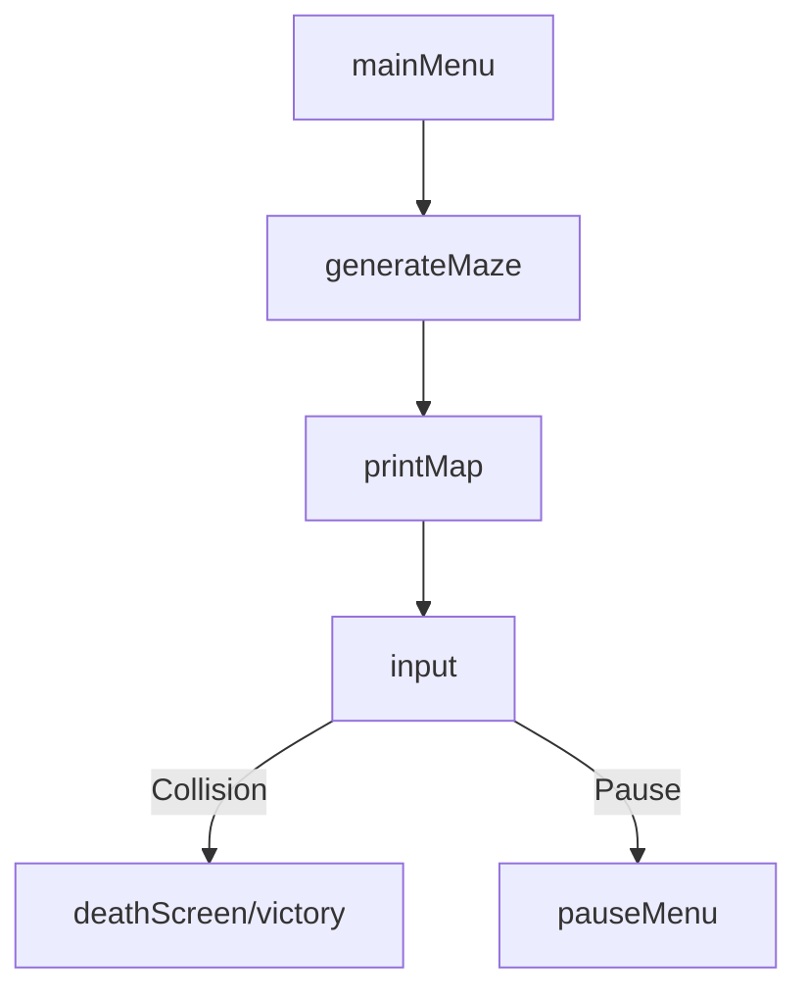

# 🟡 Pac-Man in C++ 👻🚀

## 🆔 Student ID 📚🎓  
- *Vataliya Ronak: 202401241*  
- *Tolani Dhaval: 202401228*  
- *Taksh Chauhan: 202401223*  
- *Vikas Soni: 202401214*

---

## 📑 Table of Contents  
1. [Overview](#-overview-)  
2. [Requirements](#-requirements-)  
3. [How to Compile](#-how-to-compile-)  
4. [Gameplay Controls](#gameplay-controls)  
5. [Breadth-Wise Understanding](#breadth-wise-understanding)  
6. [Depth-Wise Analysis](#4-depth-wise-analysis-30)  
7. [Key Features](#-key-features)  
8. [Limitations](#-limitations)  
9. [Resources](#-resources)  
10. [License](#-license-)  
11. [Contact](#contact-)

---

## 🎯 Overview ✨📝
This project is a simplified version of Pac-Man with randomly generated maps, custom colors, and a leaderboard. It uses DFS for maze generation and BFS for ghost behavior. The visuals use ASCII art and Unicode characters, and progress is saved in a text file.


---

## 🖥️ Requirements 🔧⚡
- 🪟 Windows OS (due to usage of Windows-specific headers like `<windows.h>` and `_kbhit()` for keyboard input).
- 🛠️ A C++ compiler that supports C++11 or higher (e.g., MinGW, MSVC).

---

## 🛠️ How to Compile

1. Make sure you have a C++ compiler installed (`g++` on Linux, `MinGW` on Windows).
2. Open a terminal in the project directory.
3. Run:

```bash
g++ main.cpp -o game
```

On success, an executable will be created:

- **Linux:** `./game`  
- **Windows:** `game.exe`

Then just run it from terminal or double-click it!

---

## 🎮 Gameplay Controls

To navigate and play your version of Pac-Man, you can use the following controls:

- **Arrow Keys**: Move Pac-Man in the desired direction.
  - **Up Arrow**: Move Up
  - **Down Arrow**: Move Down
  - **Left Arrow**: Move Left
  - **Right Arrow**: Move Right

- **WASD Keys**: Alternate controls for movement.
  - **W**: Move Up
  - **A**: Move Left
  - **S**: Move Down
  - **D**: Move Right

- **Escape Key**: Exit the game at any time.
- **Enter Key**: Confirm selections or start the game.
- **X Key**: Pause the game.

---

## 🧠 Breadth-Wise Understanding 

### Key Components
| Component          | Purpose                          | Key Functions               |
|--------------------|----------------------------------|-----------------------------|
| **Rendering**      | Draw maze, characters, UI       | `printMap()`, `drawPacman()`|
| **Game Loop**      | Update state, handle input      | `main()`, `input()`         |
| **Pathfinding**    | Ghost movement logic            | `PathFinding1()`, `BFS`     |
| **Menus**          | Navigate game states            | `mainMenu()`, `pauseMenu()` |

### Data Flow



## Game Structure

### Main Function
- **`main()`**: Entry point of the game, initializes the game and starts the main loop.
  - **`Game()`**: Initializes the game state and settings.
    - **`hideCursor()`**: Hides the console cursor for a cleaner display.
    - **`loadHighScore()`**: Loads the high score from a file.
    - **`createMaze()`**: Generates the maze layout.
    - **`initializeColors()`**: Sets the colors for the game elements.
    - **`spawnCharacters()`**: Initializes positions for Pac-Man and ghosts.
    - **`displayMainMenu()`**: Shows the main menu options.
    - **`chooseDifficulty()`**: Allows the player to select the difficulty level.
    - **`setDimensions()`**: Sets the maze dimensions based on user input.
    - **`generateMaze()`**: Creates the maze structure.
    - **`initializeGameState()`**: Resets game variables for a new game.
    - **`PacMan()`**: Creates the initial Pac-Man character.

### Game Loop
- **`while (!game.isGameOver())`**: Main game loop that continues until the game is over.
  - **`game.handleInput()`**: Processes user input for movement and actions.
    - **`checkCollision()`**: Validates movement against walls and ghosts.
    - **`movePacMan()`**: Moves Pac-Man based on user input.
    - **`eatDot()`**: Checks if Pac-Man eats a dot.
    - **`eatCherry()`**: Checks if Pac-Man eats a cherry.
    - **`pauseGame()`**: Pauses the game if 'X' is pressed.
    - **`exitGame()`**: Exits the game if 'ESC' is pressed.
  - **`game.update()`**: Updates the game state.
    - **`updateGhosts()`**: Moves ghosts towards Pac-Man.
    - **`checkGhostCollision()`**: Detects if ghosts collide with Pac-Man.
    - **`updateScore()`**: Updates the score based on dots collected.
    - **`checkVictory()`**: Checks if all dots are collected.
    - **`generateNewGhostPath()`**: Generates new paths for ghosts.
  - **`game.render()`**: Renders the current game state to the console.
    - **`printMap()`**: Displays the maze and characters.
    - **`displayScore()`**: Shows the current score.
    - **`displayLives()`**: Shows remaining lives.

### Game Over Handling
- **`if (game.isGameOver())`**: Checks if the game is over.
  - **`displayGameOverScreen()`**: Shows the game over message and score.
  - **`waitForInput()`**: Waits for 'R' to restart or 'ESC' to exit.
  - **`restartGame()`**: Restarts the game if 'R' is pressed.
  - **`return 0`**: Exits the program if 'ESC' is pressed.

---

## Depth-Wise Analysis 

### 1. Approaches Taken
- **Maze Generation**: Hardcoded (`obstaclesTop/Middle/Bottom` arrays) → Fast but inflexible.
- **Ghost AI**: 
  - `PathFinding1()`: BFS (optimal but slower).
  - `PathFinding2()`: Greedy heuristic (faster but suboptimal).
- **Tradeoffs**:  
  - **Performance vs. Accuracy**: BFS ensures shortest path but costs O(n²); greedy is O(n) but may trap Pac-Man.

### 2. Data Structures
| Structure         | Use Case                        | Pros/Cons                  |
|-------------------|---------------------------------|----------------------------|
| `vector<int>`     | Maze walls, food locations      | Fast access; fixed size    |
| `deque<float>`    | Dynamic food positions          | Efficient inserts/deletes  |
| `bool[256]`       | Keyboard input states           | Low memory; manual management |

### 3. Critical Code Snippets

**Ghost Movement (BFS):**

```cpp
void PathFinding1() {
  queue<Node> q; 
  q.push(ghostPosition);
  while (!q.empty()) {
    Node current = q.front();
    q.pop();
    // ... explore adjacent cells
  }
}
```

*Tradeoff*: BFS guarantees shortest path but uses more memory than DFS.

---

## 🎯 Key Features

- **🌀 Randomly Generated Maze:** DFS-based algorithm ensures unique maps.
- **👻 Smart Ghost AI:** Ghosts dynamically chase Pac-Man using BFS.
- **🎨 ASCII & Unicode Graphics:** Retro-style terminal visuals.
- **🏆 Leaderboard System:** Local `.txt` file tracks high scores.
- **🧩 Easter Egg:** Secret hidden in the game.
- **🎨 Custom Colors:** Colorful console effects.
- **📁 Save & Load Support:** File I/O-based data persistence.
- **🖥️ Cross-Platform:** Works on both Linux and Windows.

---

## ⚠️ Limitations

- ASCII/Unicode graphics only (no GUI).
- Basic ghost AI without advanced behaviors or difficulty scaling.
- No power-ups or level progression.
- Keyboard-only input (no mouse/controller).
- Limited error handling; large maps may slow performance.

---

## 📚 Resources

- 📌 [BFS Algorithm – Pathfinding Visualization](https://www.youtube.com/watch?v=KiCBXu4P-2Y)  
- 🧱 [Maze Generation using DFS](https://www.youtube.com/watch?v=Y37-gB83HKE)  
- 👻 [Understanding Pac-Man Ghost Behavior](https://gameinternals.com/understanding-pac-man-ghost-behavior)  
- 💡 [Game Dev Inspirations](https://www.youtube.com/watch?v=vC0d1rDmPBs)  
- 🔤 [Unicode Font – Noto Sans Canadian Aboriginal](https://fonts.google.com/noto/specimen/Noto+Sans+Canadian+Aboriginal)

---

## 📜 License ⚖️🔓

MIT License  
© 2025 Ronak Vataliya

Permission is granted to use, modify, and distribute this software with proper attribution.

---

## Contact 📧🌐🤝

**Vataliya Ronak**  
- 📧 202401241@daiict.ac.in  
- 🔗 [GitHub](https://github.com/RonakVataliya)  

**Tolani Dhaval**  
- 📧 202401228@daiict.ac.in  
- 🔗 [GitHub](https://github.com/Dhaval1306)  

**Taksh Chauhan**  
- 📧 202401223@daiict.ac.in  
- 🔗 [GitHub](https://github.com/Taksh-1105)  

**Vikas Soni**  
- 📧 202401214@daiict.ac.in  
- 🔗 [GitHub](https://github.com/Vikas-soni11)
